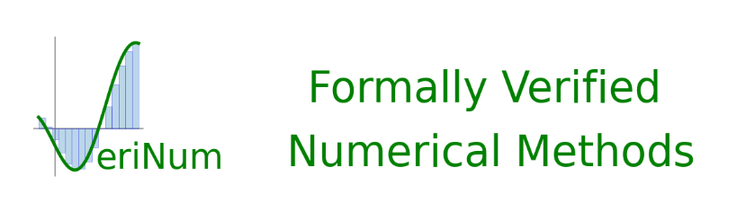

[Andrew W. Appel](https://www.cs.princeton.edu/~appel/), Princeton University

[David Bindel](https://www.cs.cornell.edu/~bindel/), Cornell University

[Jean-Baptiste Jeannin](http://www-personal.umich.edu/~jeannin/), University of Michigan

[Karthik Duraisamy](https://aero.engin.umich.edu/people/duraisamy-karthik/), University of Michigan

--------------------------------------------------------

[Ariel Kellison](https://ak-2485.github.io/), Cornell University,  _PhD Student_

[Mohit Tekriwal](https://mohittkr.github.io/), University of Michigan, _PhD Student_

[Josh Cohen](https://www.cs.princeton.edu/~jmc16/), Princeton University,  _PhD Student_

[Shengyi Wang](https://www.cs.princeton.edu/~shengyiw/), Princeton University, _Research Scientist_

Philip Johnson-Freyd, [Samuel Pollard](https://sampollard.github.io/), [Heidi Thornquist](https://en.wikipedia.org/wiki/Heidi_Thornquist),  Sandia National Labs,  _External Collaborators_

----------------------------------------------------------------

In this collection of research projects, we take a layered approach to foundational verification
of correctness and accuracy of numerical software--that is,
formal machine-checked proofs about programs (not just algorithms),
with no assumptions except specifications of instruction-set
architectures.  We build, improve, and use appropriate tools at
each layer: proving in the real numbers about discrete
algorithms; proving how floating-point algorithms approximate
real-number algorithms; reasoning about C program implementation
of floating-point algorithms; and connecting all proofs end-to-end
in Coq.

Our initial research projects (and results) are,
- [cbench_vst](https://github.com/cverified/cbench-vst)/sqrt: Square root by Newton's Method, by [Appel and Bertot](https://doi.org/10.6092/issn.1972-5787/11442).
- [VerifiedLeapfrog](https://github.com/VeriNum/VerifiedLeapfrog): A verified numerical method for an Ordinary Differential Equation, by [Kellison and Appel](https://github.com/VeriNum/VerifiedLeapfrog/raw/main/Paper.pdf).
- [VCFloat2](vcfloat): Floating-point error analysis in Coq, by Appel & Kellison, improvements on an earlier open-source project by Ramananandro et al.
- [Parallel Dot Product](https://github.com/VeriNum/pardotprod), demonstrating how to use VST to verify correctness of simple shared-memory task parallelism
- [Stationary Iterative Methods](https://github.com/VeriNum/iterative_methods) with formally verified error bounds

## Bibliography

- [Verified correctness, accuracy, and convergence of a stationary iterative linear solver: Jacobi method](https://www.cs.princeton.edu/~appel/papers/jacobi.pdf), by Mohit Tekriwal, Andrew W. Appel, Ariel E. Kellison, David Bindel, and Jean-Baptiste Jeannin. _16th Conference on Intelligent Computer Mathematics_, September 2023.
- [LAProof: a library of formal accuracy and correctness proofs for sparse linear algebra programs](https://www.cs.princeton.edu/~appel/papers/LAProof.pdf), by Ariel E. Kellison, Andrew W. Appel, Mohit Tekriwal, and David Bindel, _30th IEEE International Symposium on Computer Arithmetic_, September 2023.
- [Towards verified rounding error analysis for stationary iterative methods](https://github.com/VeriNum/iterative_methods/blob/main/correctness_workshop_paper.pdf), by Ariel Kellison, Mohit Tekriwal, Jean-Baptiste Jeannin, and Geoffrey Hulette, in _Correctness 2022: Sixth International Workshop on Software Correctness for HPC Applications_, November 2022.
- [Verified Numerical Methods for Ordinary Differential Equations](https://github.com/VeriNum/VerifiedLeapfrog/raw/main/Paper.pdf), by Ariel E. Kellison and Andrew W. Appel, in _NSV'22: 15th International Workshop on Numerical Software Verification_, August 2022.
- [VCFloat2: Floating-point Error Analysis in Coq](https://github.com/VeriNum/vcfloat/raw/master/doc/vcfloat2.pdf), by Andrew W. Appel and Ariel E. Kellison, draft, April 2022.
- [C-language floating-point proofs layered with VST and Flocq](https://doi.org/10.6092/issn.1972-5787/11442), by Andrew W. Appel and Yves Bertot, _Journal of Formalized Reasoning_ volume 13, number 1, pages 1-16.

## Funding

VeriNum's various projects are supported in part by
- National Science Foundation grant 2219757 "Formally Verified Numerical Methods", to Princeton University (Appel, Principal Investigator) and grant 2219758 to Cornell University (Bindel)
- National Science Foundation grant 2219997 "Foundational Approaches for End-to-end Formal Verification of Computational Physics" to the University of Michigan (Jeannin and Duraisamy)
- U.S. Department of Energy Computational Science Graduate Fellowship (Ariel Kellison)
- Sandia National Laboratories, funding the collaboration of Sandia participants with these projects
